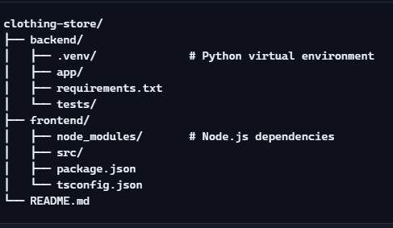

# 👕 Clothes Catalog App

A full-stack web application for browsing, searching, and managing a catalog of clothes — built with FastAPI on the backend and Vite + React + TypeScript on the frontend. Designed for clarity, responsiveness, and semantic accessibility.

## 🚀 Tech Stack

**Frontend**
- Vite ⚡ + React + TypeScript
- Semantic UI mapping with emoji, color-coded categories
- Responsive card layout with search bar and welcome message

**Backend**
- FastAPI 🐍
- JWT authentication & password hashing
- SQLAlchemy ORM with PostgreSQL
- Role-based access control via Swagger/OpenAPI
- Modular architecture with clean separation of concerns

## 📦 Features

- 🔍 Searchable clothes list with semantic tags
- 🧵 Category-based filtering (e.g., 👕 Shirts, 👖 Pants, 🧥 Jackets)
- 🧠 Backend API with secure endpoints and dependency injection
- 🛡️ Auth system with hashed passwords and JWT tokens
- 📊 Swagger docs with role-based visibility

## 🧱 Project Structure

🌐 API Documentation
Visit http://localhost:8000/docs for interactive Swagger UI.

🧪 Testing
Backend: pytest

Frontend: vitest + @testing-library/react

# Future Enhancements
Deploy as a web app in azure

Alembic migrations

upgrade to PostgreSQL

==========================

Here’s a checklist of optional polish and enhancements:

🔄 Frontend Enhancements
🧹 Add delete/restore buttons for admins

✏️ Add update form (inline or modal)

📂 Filter by type/size (dropdowns)

🧭 Add routing with React Router (e.g. /admin, /login)

🧪 Form validation and error feedback

🧪 Backend Enhancements
🧾 Add OpenAPI tags and summaries (already started!)

🧪 Add unit tests with pytest

🛡️ Rate limiting or brute-force protection

📦 Switch to PostgreSQL for production

🚀 Add Alembic migrations

🚀 Deployment Ideas
🐳 Dockerize backend and frontend

🌐 Deploy with Render, Railway, or Fly.io

🔐 Use HTTPS and secure .env handling
=========================
# Author
Built by Alan Philip
